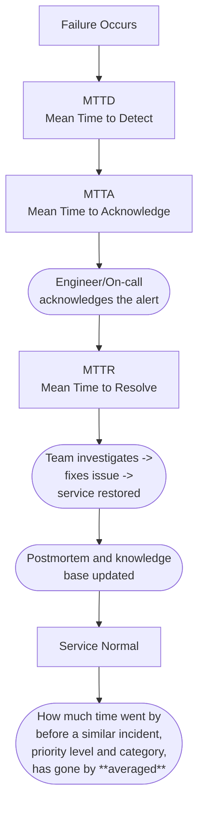

# Incident Lifecycle Timeline (P1 Example)

Here’s the **incident lifecycle flow** in a **top-down flowchart**.

---

## How Metrics Fit Together

* **MTTD**: Time between the *failure happening* and the *team detecting it*.
* **MTTA**: Time between *detection/alert* and *human acknowledgment*.
* **MTTR**: Time between *acknowledgment* and *full resolution*.
* **MTBF / MTTF**: Measured separately as *reliability metrics* (time between failures).

---

✅ Example (P1 outage):

* Failure: 1:00 PM
* Detected: 1:03 PM → **MTTD = 3 min**
* Acknowledged: 1:05 PM → **MTTA = 2 min**
* Resolved: 1:35 PM → **MTTR = 30 min**
* Total duration: **35 min downtime**

---
