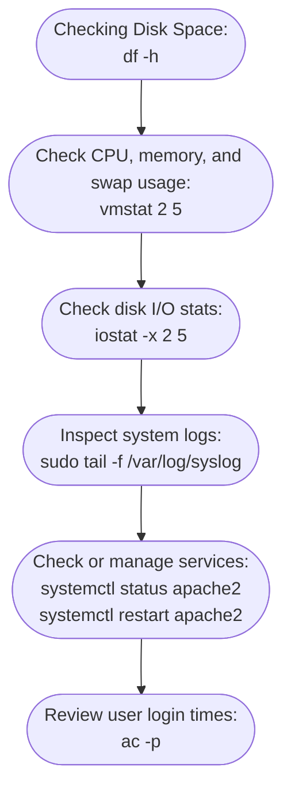

# **Linux System Monitoring & Logs**

---

## **1️⃣ `/var/log` Directory**

**Purpose:**

* `/var/log` is the central location for **system and application log files**.
* It stores logs for **system events, authentication, services, and applications**.

**Common Subdirectories and Files:**

| File / Directory                         | Description                                     |
| ---------------------------------------- | ----------------------------------------------- |
| `/var/log/syslog` or `/var/log/messages` | General system messages                         |
| `/var/log/auth.log`                      | Authentication logs (login attempts, sudo use)  |
| `/var/log/kern.log`                      | Kernel messages                                 |
| `/var/log/dmesg`                         | Boot-time messages and kernel ring buffer       |
| `/var/log/boot.log`                      | Boot process logs                               |
| `/var/log/cron`                          | Cron job execution logs                         |
| `/var/log/httpd/` or `/var/log/apache2/` | Web server logs                                 |
| `/var/log/secure`                        | Security and login information (Red Hat/CentOS) |

**Useful Commands for Logs:**

```bash
ls /var/log            # List all logs
cat /var/log/syslog    # View entire syslog
tail -f /var/log/syslog  # Follow logs in real-time
less /var/log/auth.log # Paginated view of auth logs
```

**Tip:** Logs often require **root privileges** to read:

```bash
sudo tail -f /var/log/secure
```

---

## **2️⃣ `ac` – User Login Accounting**

**Purpose:**

* Shows **login statistics**, including **total connection time** for users.

**Syntax:**

```bash
ac [options] [username]
```

**Examples:**

```bash
ac                # Show total login time for all users
ac -p             # Show login time per user
ac -d             # Show daily login totals
ac username       # Show total login time for a specific user
```

**Use Case:**

* Monitor **user activity and system usage**.

---

## **3️⃣ `vmstat` – Virtual Memory & System Performance**

**Purpose:**

* Reports **virtual memory, processes, CPU, and I/O statistics**.

**Syntax:**

```bash
vmstat [options] [delay [count]]
```

**Examples:**

```bash
vmstat           # Single snapshot of system stats
vmstat 2 5       # Update every 2 seconds, 5 times
```

**Key Columns to Know:**

| Column                    | Description                           |
| ------------------------- | ------------------------------------- |
| `r`                       | Running processes                     |
| `b`                       | Sleeping processes                    |
| `swpd`                    | Virtual memory used                   |
| `free`                    | Free memory                           |
| `buff`                    | Memory used as buffers                |
| `cache`                   | Memory used as cache                  |
| `si` / `so`               | Swap in / swap out                    |
| `us` / `sy` / `id` / `wa` | CPU user/system/idle/wait percentages |

**Use Case:**

* Quick system health check, memory bottlenecks, or I/O issues.

---

## **4️⃣ `iostat` – I/O Statistics**

**Purpose:**

* Reports **CPU statistics and I/O performance** for disks.

**Syntax:**

```bash
iostat [options] [interval [count]]
```

**Examples:**

```bash
iostat           # Basic CPU and I/O summary
iostat -x 2 5    # Extended stats every 2 seconds, 5 times
```

**Key Metrics:**

* `tps` – Transfers per second
* `kB_read/s` / `kB_wrtn/s` – Data read/written per second
* `%util` – Percentage of time the device was busy

**Use Case:**

* Identify **slow disks, high I/O wait**, and system performance issues.

---

## **5️⃣ `df` – Disk Space Usage**

**Purpose:**

* Reports **disk usage for mounted filesystems**.

**Syntax:**

```bash
df [options] [filesystem]
```

**Examples:**

```bash
df              # Show all filesystems in blocks
df -h           # Human-readable format (GB, MB)
df -T           # Show filesystem type
df -i           # Show inode usage
```

**Key Notes:**

* Useful to check **full disks** or monitor filesystem usage.
* Combine with `du` for **directory-level usage**.

---

## **6️⃣ `systemctl` – Manage Systemd Services**

**Purpose:**

* Control and inspect **systemd services**, units, and system states.

**Syntax:**

```bash
systemctl [command] [unit]
```

**Common Commands:**

| Command      | Description                 | Example                               |
| ------------ | --------------------------- | ------------------------------------- |
| `status`     | Show status of a service    | `systemctl status sshd`               |
| `start`      | Start a service             | `systemctl start apache2`             |
| `stop`       | Stop a service              | `systemctl stop cron`                 |
| `restart`    | Restart a service           | `systemctl restart mysql`             |
| `enable`     | Start service on boot       | `systemctl enable nginx`              |
| `disable`    | Prevent service on boot     | `systemctl disable nginx`             |
| `list-units` | List active services        | `systemctl list-units --type=service` |
| `is-active`  | Check if service is running | `systemctl is-active sshd`            |

**Use Case:**

* Start, stop, or monitor **system services**.
* Useful for troubleshooting **service failures**.

---

## **7️⃣ Workflow Example – System Monitoring**


---

