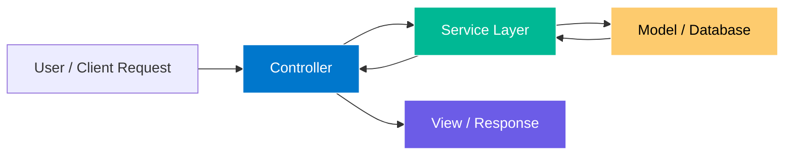

# 🧩 Python MVC Architecture — Introduction and Design Overview

---

## 🧠 What Is MVC?

**MVC** stands for **Model–View–Controller**, a software design pattern that separates an application into **three main layers**.
The goal is to make code:

* **Modular** – each layer has a specific responsibility
* **Maintainable** – changes in one part don’t break others
* **Reusable** – logic can be reused in multiple interfaces (CLI, Web, API, etc.)

---

## 🔹 Why Use MVC?

| Benefit                    | Description                                                                        |
| -------------------------- | ---------------------------------------------------------------------------------- |
| **Separation of Concerns** | Each component handles a distinct function, improving code clarity and modularity. |
| **Easier Maintenance**     | You can modify database logic or UI independently.                                 |
| **Scalability**            | Adding new features (like web views, APIs, or reports) becomes easier.             |
| **Reusability**            | The same model and business logic can power a web app, REST API, or CLI tool.      |

---

## 🔹 The Core MVC Components

| Component      | Responsibility                                                                                 | Example (in Python)                                       |
| -------------- | ---------------------------------------------------------------------------------------------- | --------------------------------------------------------- |
| **Model**      | Represents the data and interacts with the database.                                           | A class managing CRUD operations using `mysql.connector`. |
| **View**       | Defines how data is presented (HTML templates, JSON responses, CLI output).                    | Flask Jinja templates or API JSON.                        |
| **Controller** | Receives user input, processes it (possibly through a service), and updates the Model or View. | Flask route functions.                                    |

---

## 🔹 Adding the **Service Layer**

While MVC is great, many large applications add an additional layer called the **Service Layer** (or **Business Logic Layer**).

| Layer             | Purpose                                                                                                                                                                  |
| ----------------- | ------------------------------------------------------------------------------------------------------------------------------------------------------------------------ |
| **Service Layer** | Holds business logic that sits between the Controller and the Model. It ensures Controllers remain lightweight and Models handle only persistence (database operations). |

For example:

* Controller: receives request
* Service Layer: validates data, enforces rules, applies transformations
* Model: saves or retrieves data

---

## 🔹 MVC + Service Layer Workflow



---

## 🔹 Example Flow (Python Flask App)

Let’s visualize a simple request in your **Flask + MySQL contact app** using MVC + Service:

1. **User action:**
   The user submits a new contact form or sends a POST request to `/api/contacts`.

2. **Controller (Flask Route):**
   The controller receives the request and calls the service layer.

   ```python
   # controller
   from service import ContactService
   service = ContactService()

   @app.route('/api/contacts', methods=['POST'])
   def create_contact():
       data = request.get_json()
       return service.add_contact(data)
   ```

3. **Service Layer:**
   The service validates the input and delegates persistence to the model.

   ```python
   # service.py
   from model import ContactModel

   class ContactService:
       def __init__(self):
           self.model = ContactModel()

       def add_contact(self, data):
           name = data.get('name')
           phone = data.get('phone')
           email = data.get('email')

           # Business rule: name must be at least 2 chars
           if len(name) < 2:
               return {"error": "Name too short"}, 400

           contact_id = self.model.add_contact(name, phone, email)
           return {"message": "Contact added", "id": contact_id}, 201
   ```

4. **Model:**
   The model executes SQL operations and returns results.

   ```python
   # model.py
   def add_contact(self, name, phone, email):
       query = "INSERT INTO contacts (name, phone, email) VALUES (%s, %s, %s)"
       self.cursor.execute(query, (name, phone, email))
       self.conn.commit()
       return self.cursor.lastrowid
   ```

5. **Response (View):**
   Flask returns a JSON response to the user, handled by the controller.

---

## 🧠 Key Takeaways

| Concept           | Purpose                        | Example                          |
| ----------------- | ------------------------------ | -------------------------------- |
| **Model**         | Data access & persistence      | MySQL queries                    |
| **Service Layer** | Business rules & validation    | Data validation, transformations |
| **Controller**    | Handles requests & routes data | Flask routes                     |
| **View**          | Presentation                   | JSON or HTML output              |

---

## ⚙️ Summary

The **MVC with Service Layer** design ensures:

* Each component is **independent** and **testable**.
* Business logic doesn’t leak into the Controller.
* Models remain focused on data storage.
* The architecture can scale from **simple apps** to **enterprise systems**.

---
