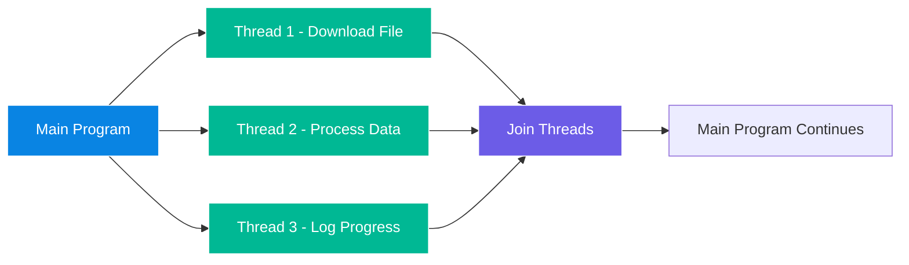

# 🧩 Python Multithreading and Concurrency

---

## 🧠 What Is Concurrency?

**Concurrency** is when a program can manage **multiple tasks at the same time** — not necessarily executing them *simultaneously*, but ensuring they make progress *independently*.

In Python, concurrency can be achieved using:

1. **Multithreading** → Multiple threads sharing the same memory space.
2. **Multiprocessing** → Multiple processes, each with its own memory.
3. **AsyncIO** → Cooperative multitasking using asynchronous coroutines.

---

## 🔹 What Is a Thread?

A **thread** is a lightweight subprocess — the smallest unit of a program that can run independently.
Each thread runs in the **same process memory**, so they can share data and resources easily.

However, in **CPython**, there’s a limitation called the **Global Interpreter Lock (GIL)**, which means only one thread executes Python bytecode at a time.
Multithreading in Python is most useful for **I/O-bound** tasks (like file operations, web requests, database calls).

---

## 🔹 The `threading` Module

Python provides the `threading` module to create and manage threads.

### ✅ Example 1: Basic Thread Creation

```python
import threading
import time

def greet(name):
    print(f"Starting thread for {name}")
    time.sleep(2)
    print(f"Hello, {name}!")

# Create two threads
t1 = threading.Thread(target=greet, args=("Alice",))
t2 = threading.Thread(target=greet, args=("Bob",))

# Start threads
t1.start()
t2.start()

# Wait for both threads to finish
t1.join()
t2.join()

print("All threads finished!")
```

🧩 **Explanation:**

* `Thread(target=func, args=())` creates a new thread.
* `start()` begins execution.
* `join()` blocks the main thread until the child thread finishes.

Output:

```
Starting thread for Alice
Starting thread for Bob
Hello, Alice!
Hello, Bob!
All threads finished!
```

---

## 🔹 Example 2: Multithreading in Practice (Downloading Simulation)

```python
import threading
import time

def download_file(file_name):
    print(f"Downloading {file_name}...")
    time.sleep(3)
    print(f"{file_name} downloaded!")

files = ["file1.zip", "file2.zip", "file3.zip"]

threads = []

for f in files:
    t = threading.Thread(target=download_file, args=(f,))
    t.start()
    threads.append(t)

# Wait for all threads
for t in threads:
    t.join()

print("All downloads complete!")
```

🧠 **Concepts demonstrated:**

* Each file is “downloaded” in parallel threads.
* Main program waits for all downloads before finishing.

---

## 🔹 Example 3: Using `ThreadPoolExecutor` (Simpler Thread Management)

Instead of manually managing threads, use Python’s **concurrent.futures** module.

```python
from concurrent.futures import ThreadPoolExecutor
import time

def task(name):
    print(f"Starting task {name}")
    time.sleep(2)
    return f"Task {name} done"

with ThreadPoolExecutor(max_workers=3) as executor:
    results = executor.map(task, ['A', 'B', 'C', 'D'])
    for result in results:
        print(result)
```

✅ This pattern is cleaner and automatically handles:

* Thread creation
* Task scheduling
* Resource cleanup

---

## 🔹 When to Use Multithreading

| Use Case           | Suitable? | Example                                  |
| ------------------ | --------- | ---------------------------------------- |
| I/O-bound tasks    | ✅ Yes     | File I/O, API requests, database queries |
| CPU-bound tasks    | ❌ No      | Heavy computation, data processing       |
| Real-time response | ✅ Yes     | GUI, network servers, data streaming     |

For **CPU-bound** tasks, use **`multiprocessing`**, which runs each task in a separate Python process (bypassing the GIL).

---

## 🔹 Synchronizing Threads

When multiple threads access shared data, use **Locks** to avoid race conditions.

```python
import threading

counter = 0
lock = threading.Lock()

def increment():
    global counter
    for _ in range(100000):
        with lock:
            counter += 1

threads = [threading.Thread(target=increment) for _ in range(2)]

for t in threads:
    t.start()
for t in threads:
    t.join()

print("Final counter:", counter)
```

Without a `Lock`, both threads may update `counter` simultaneously and corrupt the result.

---

## 🔹 Visualizing Concurrency



This shows how threads run concurrently and then synchronize before the main program continues.

---

## 🧠 Key Concepts Summary

| Concept                | Description                                                              |
| ---------------------- | ------------------------------------------------------------------------ |
| **Thread**             | Lightweight subprocess that shares memory with others                    |
| **GIL**                | Python mechanism that limits one thread to execute Python code at a time |
| **I/O-bound**          | Tasks waiting for external operations (I/O, API calls)                   |
| **Lock**               | Prevents race conditions on shared data                                  |
| **ThreadPoolExecutor** | High-level thread manager for multiple tasks                             |

---

## 🧩 Exercises

1. **Simple Threaded Print**
   Write a program that prints numbers from 1–10 using two threads.

2. **Concurrent Downloads**
   Simulate downloading 5 files concurrently using threads.

3. **Race Condition Demo**
   Create a shared counter updated by multiple threads. Run it with and without a `Lock` and compare results.

4. **Thread Pool**
   Use `ThreadPoolExecutor` to compute the square of numbers 1–10 concurrently.

---
