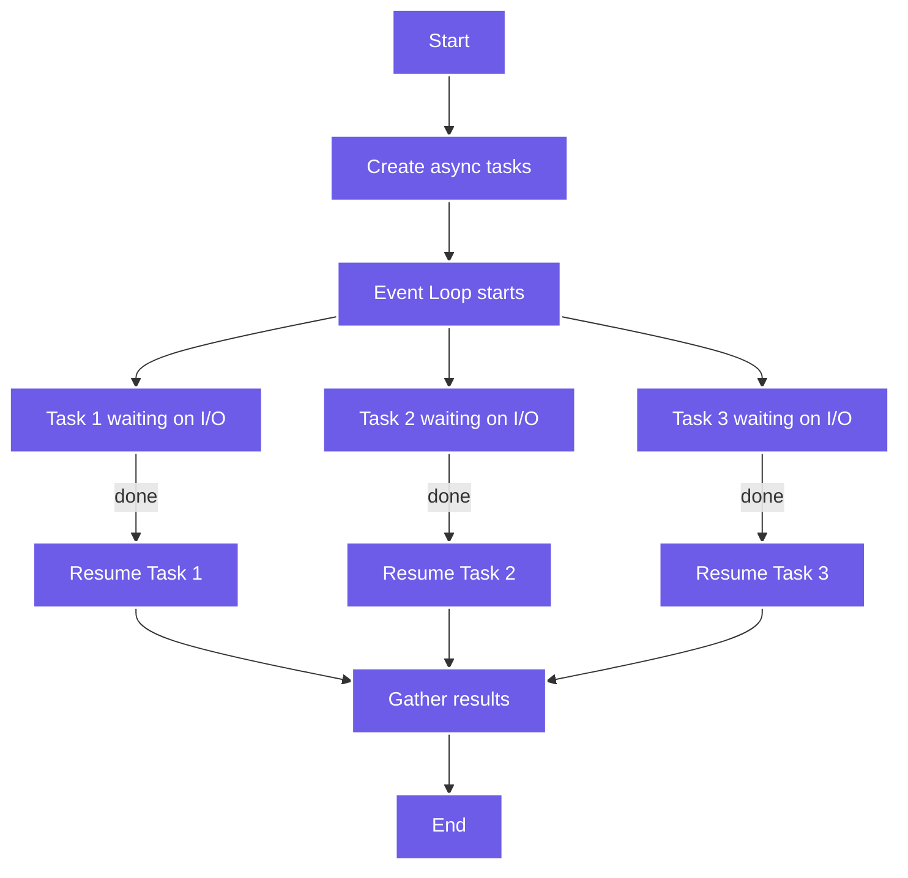

# ⚙️ Asynchronous Programming with `asyncio`

---

## 🧠 What Is Asynchronous Programming?

**Asynchronous programming** allows a program to handle multiple tasks *concurrently* without waiting for one to finish before starting another.

Instead of *blocking* while waiting for slow operations (like I/O, API calls, or database access), Python’s **`asyncio`** lets you pause a task (`await`) and switch to another until the first is ready.

This makes it **ideal for I/O-bound** workloads with high concurrency.

---

## 🔹 The Problem with Traditional Code

Example of **blocking (synchronous)** code:

```python
import time

def fetch_data():
    time.sleep(2)  # Simulate network delay
    return "Data received"

def main():
    print(fetch_data())
    print(fetch_data())
    print(fetch_data())

main()
```

🕒 Total time: **≈ 6 seconds** (each call blocks the next one)

---

## 🔹 AsyncIO Solution

With `asyncio`, we can run these tasks **concurrently**:

```python
import asyncio

async def fetch_data(name):
    print(f"Fetching {name}...")
    await asyncio.sleep(2)
    print(f"{name} received")
    return f"Result from {name}"

async def main():
    tasks = [fetch_data("Task 1"), fetch_data("Task 2"), fetch_data("Task 3")]
    results = await asyncio.gather(*tasks)
    print(results)

asyncio.run(main())
```

🕒 Total time: **≈ 2 seconds**, not 6!
Each task *awaits* while the others continue.

---

## ⚙️ How AsyncIO Works

### 🔸 Event Loop

At the heart of `asyncio` is the **event loop** — it:

* Manages and schedules asynchronous tasks
* Switches between tasks when they reach a waiting point (`await`)
* Resumes them when results are ready

```python
import asyncio

async def greet():
    print("Hello")
    await asyncio.sleep(1)
    print("World")

asyncio.run(greet())
```

Output:

```
Hello
... (1 second pause)
World
```

---

## 🔹 Keywords: `async` and `await`

| Keyword | Purpose                                                   |
| ------- | --------------------------------------------------------- |
| `async` | Declares a function as asynchronous (returns a coroutine) |
| `await` | Pauses execution until the awaited coroutine finishes     |

**Example:**

```python
async def download_file():
    await asyncio.sleep(2)
    print("Download complete")
```

> ⚠️ You can only use `await` **inside** an `async` function.

---

## 🔹 Creating and Managing Tasks

When you create multiple tasks, the event loop runs them concurrently.

```python
import asyncio

async def worker(id):
    print(f"Worker {id} started")
    await asyncio.sleep(2)
    print(f"Worker {id} finished")

async def main():
    tasks = [asyncio.create_task(worker(i)) for i in range(3)]
    await asyncio.gather(*tasks)

asyncio.run(main())
```

🧩 **Output (interleaved):**

```
Worker 0 started
Worker 1 started
Worker 2 started
Worker 0 finished
Worker 1 finished
Worker 2 finished
```

---

## 🔹 Using `asyncio.gather()` vs. `await`

* `await` runs a coroutine **by itself**
* `asyncio.gather()` runs **many coroutines concurrently**

Example:

```python
await task1()  # runs alone
results = await asyncio.gather(task1(), task2(), task3())  # runs together
```

---

## 🔹 Mixing Synchronous and Asynchronous Code

You can run blocking (synchronous) code in a separate thread using `run_in_executor`.

```python
import asyncio
import time

def blocking_task():
    time.sleep(2)
    print("Blocking task finished")

async def main():
    loop = asyncio.get_running_loop()
    await loop.run_in_executor(None, blocking_task)
    print("Async part done")

asyncio.run(main())
```

🧠 **Key point:**
This lets you integrate traditional blocking libraries (like file or DB access) without freezing the event loop.

---

## 🔹 Handling Exceptions in AsyncIO

Async tasks can raise exceptions just like regular functions:

```python
import asyncio

async def faulty_task():
    raise ValueError("Something went wrong")

async def main():
    try:
        await faulty_task()
    except ValueError as e:
        print(f"Caught error: {e}")

asyncio.run(main())
```

If you’re using `gather`, use `return_exceptions=True`:

```python
results = await asyncio.gather(task1(), faulty_task(), return_exceptions=True)
```

---

## 🔹 Real-World Example: Concurrent Web Requests

Here’s an example using `aiohttp` (async HTTP library):

```bash
pip install aiohttp
```

Then:

```python
import asyncio
import aiohttp

urls = [
    "https://example.com",
    "https://python.org",
    "https://httpbin.org/get"
]

async def fetch(session, url):
    async with session.get(url) as response:
        print(f"{url} -> {response.status}")
        return await response.text()

async def main():
    async with aiohttp.ClientSession() as session:
        tasks = [fetch(session, url) for url in urls]
        results = await asyncio.gather(*tasks)

asyncio.run(main())
```

🧩 Output:

```
https://example.com -> 200
https://python.org -> 200
https://httpbin.org/get -> 200
```

All three URLs are fetched *concurrently*.

---

## 🔹 Visualizing AsyncIO Flow



---

## 🧩 Summary

| Concept              | Description                                     |
| -------------------- | ----------------------------------------------- |
| **Event Loop**       | Core engine that manages asynchronous execution |
| **Coroutine**        | Function defined with `async def`               |
| **await**            | Pauses a coroutine until another finishes       |
| **Task**             | Wraps a coroutine for concurrent scheduling     |
| **asyncio.gather()** | Runs multiple coroutines concurrently           |
| **aiohttp**          | Asynchronous HTTP client                        |

---

## 🧠 Exercises

1. **Delay Simulation:**
   Create three async functions that simulate API calls with different delays. Use `asyncio.gather` to run them concurrently.

2. **File Downloader:**
   Use `aiohttp` to download multiple files at once.

3. **Mixed Execution:**
   Use `run_in_executor()` to run a blocking CPU task while async tasks fetch data.

4. **Error Handling:**
   Modify one async task to raise an exception and handle it gracefully using `return_exceptions=True`.

---
