# ⚙️ Comparing Multithreading, Multiprocessing, and AsyncIO in Python

---

## 🧠 The Big Picture

Python supports **three main concurrency models**:

| Model               | Description                                                  | Best For                               |
| ------------------- | ------------------------------------------------------------ | -------------------------------------- |
| **Multithreading**  | Multiple threads share the same memory space                 | I/O-bound tasks                        |
| **Multiprocessing** | Multiple processes run in parallel, each with its own memory | CPU-bound tasks                        |
| **AsyncIO**         | Single-threaded concurrency using asynchronous coroutines    | High I/O concurrency with low overhead |

---

## 🔹 1. Multithreading

* Uses the **`threading`** or **`concurrent.futures.ThreadPoolExecutor`** module.
* Threads share memory — ideal for lightweight I/O operations.
* Affected by the **Global Interpreter Lock (GIL)**, which limits true parallelism.

**Use it for:**

* Reading/writing files
* Waiting on network or database responses
* GUI responsiveness

### Example:

```python
import threading
import time

def task(name):
    print(f"Thread {name} starting")
    time.sleep(2)
    print(f"Thread {name} done")

threads = [threading.Thread(target=task, args=(i,)) for i in range(3)]

for t in threads:
    t.start()

for t in threads:
    t.join()

print("All threads complete.")
```

🧩 **Key point:** Multiple tasks appear to run simultaneously, but only one thread runs Python bytecode at a time.

---

## 🔹 2. Multiprocessing

* Uses the **`multiprocessing`** or **`concurrent.futures.ProcessPoolExecutor`** module.
* Bypasses the **GIL** — each process runs in its **own Python interpreter**.
* Suitable for **CPU-bound** tasks (e.g., heavy computation, data analysis).

**Use it for:**

* Data processing
* Image rendering
* Scientific computations

### Example:

```python
from multiprocessing import Process
import os, time

def compute(n):
    print(f"Process {os.getpid()} computing {n}^2")
    time.sleep(1)
    print(f"Result: {n*n}")

processes = [Process(target=compute, args=(i,)) for i in range(3)]

for p in processes:
    p.start()

for p in processes:
    p.join()

print("All processes complete.")
```

🧩 **Key point:** Each process runs independently with its own memory — no shared data (use `Queue` or `Pipe` to communicate).

---

## 🔹 3. AsyncIO

* Uses the **`asyncio`** library.
* Runs in a **single thread**, but switches between tasks **when one is waiting** (e.g., I/O, sleep).
* Perfect for **high concurrency** without the overhead of threads or processes.

**Use it for:**

* Network servers
* API calls
* Concurrent I/O operations

### Example:

```python
import asyncio

async def fetch_data(name):
    print(f"Fetching {name}...")
    await asyncio.sleep(2)
    print(f"{name} done")

async def main():
    tasks = [fetch_data(n) for n in ["A", "B", "C"]]
    await asyncio.gather(*tasks)

asyncio.run(main())
```

🧩 **Key point:** Tasks run *concurrently* but not *in parallel*. The event loop switches between them efficiently.

---

## ⚖️ Comparison Table

| Feature               | Multithreading           | Multiprocessing     | AsyncIO                         |
| --------------------- | ------------------------ | ------------------- | ------------------------------- |
| **Parallelism**       | ❌ No (due to GIL)        | ✅ Yes               | ❌ No (concurrent, not parallel) |
| **Memory**            | Shared                   | Separate            | Shared                          |
| **Speed (CPU tasks)** | Slow                     | Fast                | Slow                            |
| **Speed (I/O tasks)** | Fast                     | Moderate            | Very fast                       |
| **Overhead**          | Low                      | High                | Very low                        |
| **Communication**     | Shared variables (locks) | IPC (queues, pipes) | Coroutines                      |
| **Best for**          | I/O-bound                | CPU-bound           | Network I/O, async services     |

---

## 🔹 Real-World Examples

| Scenario                                | Best Choice                  | Reason                             |
| --------------------------------------- | ---------------------------- | ---------------------------------- |
| Downloading 1000 files                  | **Multithreading / AsyncIO** | Many small I/O tasks               |
| Processing 1 GB of images               | **Multiprocessing**          | CPU-intensive                      |
| Web server handling 10,000 requests/sec | **AsyncIO**                  | High concurrency, non-blocking I/O |
| Updating database records               | **Multithreading**           | Waiting on I/O, not CPU            |
| Large data simulation                   | **Multiprocessing**          | Heavy CPU usage                    |

---

## 🔹 Visualizing the Models

```mermaid
graph TD
    A[Main Program] -->|Creates Threads| B1[Thread 1 - Shared Memory]
    A -->|Creates Threads| B2[Thread 2 - Shared Memory]
    A -->|Creates Threads| B3[Thread 3 - Shared Memory]

    A2[Main Program] -->|Spawns Processes| C1[Process 1 - Own Memory]
    A2 -->|Spawns Processes| C2[Process 2 - Own Memory]
    A2 -->|Spawns Processes| C3[Process 3 - Own Memory]

    A3[Event Loop] -->|Schedules| D1[Task 1 Awaiting I/O]
    A3 -->|Schedules| D2[Task 2 Awaiting I/O]
    A3 -->|Schedules| D3[Task 3 Awaiting I/O]

    subgraph Multithreading
        B1
        B2
        B3
    end

    subgraph Multiprocessing
        C1
        C2
        C3
    end

    subgraph AsyncIO
        D1
        D2
        D3
    end

    classDef thread fill:#00b894,stroke:#fff,color:#fff;
    classDef process fill:#0984e3,stroke:#fff,color:#fff;
    classDef async fill:#6c5ce7,stroke:#fff,color:#fff;

    class B1,B2,B3 thread;
    class C1,C2,C3 process;
    class D1,D2,D3 async;
```



🧩 **Interpretation:**

* **Threads** share one memory space → risk of race conditions.
* **Processes** are isolated → safe, but communication is slower.
* **AsyncIO** keeps one event loop switching between tasks.

---

## 🧠 Summary

| Concept             | Description                                                          |
| ------------------- | -------------------------------------------------------------------- |
| **Concurrency**     | Multiple tasks making progress at once                               |
| **Parallelism**     | Multiple tasks running *at the same time*                            |
| **GIL**             | Prevents multiple Python threads from executing bytecode in parallel |
| **Multithreading**  | Best for I/O-bound work                                              |
| **Multiprocessing** | Best for CPU-bound work                                              |
| **AsyncIO**         | Best for high-concurrency I/O without threads                        |

---

## 🧩 Exercises

1. **CPU vs I/O Test:**
   Write two versions of a file-downloading script — one using threads and one using processes. Compare execution time.

2. **Async API Calls:**
   Use `asyncio` and `aiohttp` to fetch multiple URLs concurrently.

3. **Parallel Math:**
   Compute factorials for 10 numbers using `multiprocessing.Pool`.

4. **Mixing Models:**
   Create a script that uses `ThreadPoolExecutor` for I/O and `ProcessPoolExecutor` for computation.

---
