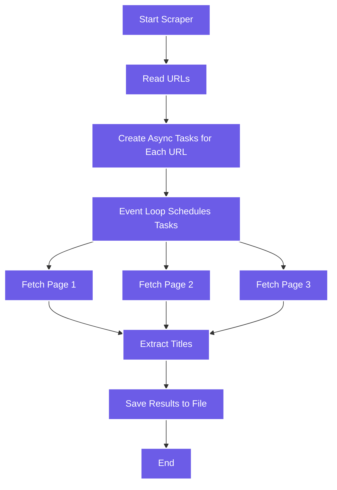

# 🚀 Project: Asynchronous Web Scraper with `asyncio` and `aiohttp`

---

## 🧠 Learning Objectives

By the end of this project, students will:

* Understand how to combine `asyncio` and `aiohttp` for concurrent I/O.
* Learn how to manage tasks, handle exceptions, and write to files asynchronously.
* Build an efficient mini scraper that fetches multiple pages in parallel.

---

## 🔹 Project Overview

We’ll build a **simple web scraper** that:

1. Takes a list of URLs.
2. Downloads each page concurrently using async requests.
3. Extracts the `<title>` tag from each page.
4. Saves results to a file.

---

## 🧩 Step 1: Install Dependencies

Before starting, install `aiohttp` and `aiodns` (for better DNS resolution):

```bash
pip install aiohttp aiodns
```

---

## 🔹 Step 2: Basic Project Structure

```
async_scraper/
├── scraper.py
├── urls.txt
└── results.txt
```

**`urls.txt`** — contains one URL per line:

```
https://example.com
https://python.org
https://wikipedia.org
```

---

## 🔹 Step 3: The Scraper Code

```python
# scraper.py
import asyncio
import aiohttp
import re

async def fetch_page(session, url):
    """Fetch page content and extract the <title> tag."""
    try:
        async with session.get(url, timeout=10) as response:
            html = await response.text()
            title = re.search(r'<title>(.*?)</title>', html, re.IGNORECASE)
            title_text = title.group(1) if title else "No title found"
            print(f"{url} -> {title_text}")
            return url, title_text
    except Exception as e:
        print(f"Error fetching {url}: {e}")
        return url, None

async def scrape_all(urls):
    """Fetch all URLs concurrently."""
    async with aiohttp.ClientSession() as session:
        tasks = [fetch_page(session, url) for url in urls]
        results = await asyncio.gather(*tasks, return_exceptions=True)
        return results

def save_results(results, filename="results.txt"):
    """Save results to a file."""
    with open(filename, "w", encoding="utf-8") as f:
        for url, title in results:
            f.write(f"{url} -> {title}\n")

async def main():
    with open("urls.txt") as f:
        urls = [line.strip() for line in f if line.strip()]

    results = await scrape_all(urls)
    save_results(results)
    print("\n✅ Scraping complete! Results saved to results.txt")

if __name__ == "__main__":
    asyncio.run(main())
```

---

## 🔹 Step 4: Running the Project

```bash
python scraper.py
```

**Expected output:**

```
https://example.com -> Example Domain
https://python.org -> Welcome to Python.org
https://wikipedia.org -> Wikipedia
✅ Scraping complete! Results saved to results.txt
```

---

## 🔹 Step 5: Handling Errors Gracefully

You can enhance the error handling in `fetch_page()` to retry failed requests:

```python
async def fetch_page(session, url, retries=3):
    for attempt in range(retries):
        try:
            async with session.get(url, timeout=10) as response:
                html = await response.text()
                title = re.search(r'<title>(.*?)</title>', html, re.IGNORECASE)
                title_text = title.group(1) if title else "No title found"
                return url, title_text
        except Exception as e:
            print(f"Retry {attempt+1}/{retries} for {url} - Error: {e}")
            await asyncio.sleep(1)
    return url, None
```

---

## 🔹 Step 6: Adding Time Measurement

Measure how long the scraper takes to run:

```python
import time

if __name__ == "__main__":
    start = time.perf_counter()
    asyncio.run(main())
    duration = time.perf_counter() - start
    print(f"⏱️ Completed in {duration:.2f} seconds")
```

Try increasing the number of URLs — you’ll see how **asynchronous execution scales efficiently**!

---

## 🔹 Step 7: Visualizing the Flow



---

## 🔹 Step 8: Experiment Ideas

💡 Encourage students to:

1. Add **progress bars** using `tqdm.asyncio`.
2. Store results in **JSON or CSV** instead of text.
3. Add **rate limiting** (e.g., wait 0.5s between requests).
4. Use `BeautifulSoup` (with `bs4`) for more complex HTML parsing.
5. Combine with **`multiprocessing`** for mixed concurrency (multiple event loops per process).

---

## 🧠 Key Takeaways

| Concept                | Description                                            |
| ---------------------- | ------------------------------------------------------ |
| **AsyncIO**            | Provides an event loop for concurrent I/O              |
| **aiohttp**            | Asynchronous HTTP client                               |
| **await**              | Yields control until a coroutine completes             |
| **asyncio.gather()**   | Runs many coroutines at once                           |
| **Event Loop**         | Core that schedules and resumes async tasks            |
| **Exception Handling** | Use `return_exceptions=True` or retries for robustness |

---

## 🧩 Challenge Extension

👉 **Challenge:**
Modify this scraper to **follow links** found on the first page and fetch titles from the linked pages (2 levels deep).

That turns the project into a **mini web crawler** — perfect for a capstone exercise in your Python async module.

---
