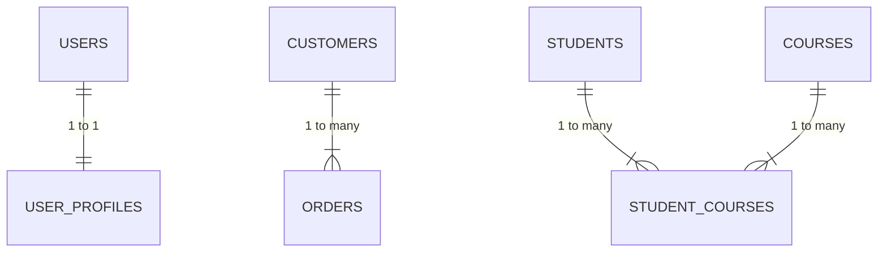

# Relationship Types

👉 **One-to-One (1:1)**
👉 **One-to-Many (1:N)**
👉 **Many-to-Many (M:N)**

These relationships describe **how tables are linked** using **primary keys (PK)** and **foreign keys (FK)** — the core of relational database design.

---

## 🧩 1. One-to-One (1:1) Relationship

### 🔹 Definition:

A **one-to-one relationship** means that **each record in Table A relates to exactly one record in Table B**, and vice versa.

✅ Each row in the first table **matches at most one** row in the second table.

---

### 🧠 Example: `users` and `user_profiles`

| users    |    | user_profiles |
| -------- | -- | ------------- |
| user_id  | 🔑 | profile_id    |
| username |    | address       |
| email    |    | phone         |

Each **user** has **exactly one** **profile**, and each **profile** belongs to **one** **user**.

---

### 🧱 SQL Example

```sql
CREATE TABLE users (
  user_id INT PRIMARY KEY,
  username VARCHAR(50),
  email VARCHAR(100)
);

CREATE TABLE user_profiles (
  profile_id INT PRIMARY KEY,
  user_id INT UNIQUE,
  address VARCHAR(100),
  phone VARCHAR(20),
  FOREIGN KEY (user_id) REFERENCES users(user_id)
);
```

**Explanation:**

* `user_id` in `user_profiles` references the same ID in `users`.
* The `UNIQUE` constraint ensures **only one profile per user**.

---

### 🧩 Use Cases

| Example                | Description                              |
| ---------------------- | ---------------------------------------- |
| User ↔ Profile         | Split user login info from personal data |
| Employee ↔ Company Car | One employee has one company car         |
| Person ↔ Passport      | Each person has exactly one passport     |

---

### 💡 Why Use It?

* To **split large tables** into smaller logical parts
* To **isolate sensitive information** (e.g., store user credentials separately)

---

## 🧩 2. One-to-Many (1:N) Relationship

### 🔹 Definition:

A **one-to-many relationship** means that **one record in Table A** can be related to **many records in Table B**,
but each record in Table B relates to **only one** record in Table A.

✅ This is the **most common** relationship in databases.

---

### 🧠 Example: `customers` and `orders`

| customers   |    | orders           |
| ----------- | -- | ---------------- |
| customer_id | 🔑 | order_id         |
| name        |    | customer_id (FK) |
| email       |    | order_date       |

A **customer** can have **many orders**,
but each **order** belongs to **only one customer**.

---

### 🧱 SQL Example

```sql
CREATE TABLE customers (
  customer_id INT PRIMARY KEY,
  name VARCHAR(100),
  email VARCHAR(100)
);

CREATE TABLE orders (
  order_id INT PRIMARY KEY,
  customer_id INT,
  order_date DATE,
  FOREIGN KEY (customer_id) REFERENCES customers(customer_id)
);
```

---

### 🧩 Use Cases

| Example                | Description                        |
| ---------------------- | ---------------------------------- |
| Customer → Orders      | One customer can place many orders |
| Teacher → Students     | One teacher teaches many students  |
| Author → Books         | One author writes many books       |
| Department → Employees | One department has many employees  |

---

### 💡 Why Use It?

* To model **parent-child** relationships
* To **group related data** under one main entity
* Enables efficient **data organization and querying**

---

## 🧩 3. Many-to-Many (M:N) Relationship

### 🔹 Definition:

A **many-to-many relationship** means that **records in Table A can relate to multiple records in Table B**,
and vice versa.

🚫 Most RDBMSs **don’t support direct many-to-many relationships** —
so we use a **junction (bridge) table** to link them.

---

### 🧠 Example: `students` and `courses`

| students   |    | student_courses |   | courses      |
| ---------- | -- | --------------- | - | ------------ |
| student_id | 🔑 | student_id (FK) |   | course_id 🔑 |
| name       |    | course_id (FK)  |   | course_name  |

A **student** can enroll in **many courses**,
and each **course** can have **many students**.

---

### 🧱 SQL Example

```sql
CREATE TABLE students (
  student_id INT PRIMARY KEY,
  name VARCHAR(100)
);

CREATE TABLE courses (
  course_id INT PRIMARY KEY,
  course_name VARCHAR(100)
);

CREATE TABLE student_courses (
  student_id INT,
  course_id INT,
  PRIMARY KEY (student_id, course_id),
  FOREIGN KEY (student_id) REFERENCES students(student_id),
  FOREIGN KEY (course_id) REFERENCES courses(course_id)
);
```

**Explanation:**

* `student_courses` is the **junction table** (also called a **linking** or **associative table**).
* Each record connects one student to one course.
* The **composite primary key** (`student_id`, `course_id`) prevents duplicates.

---

### 🧩 Use Cases

| Example               | Description                                   |
| --------------------- | --------------------------------------------- |
| Students ↔ Courses    | Many students can take many courses           |
| Authors ↔ Books       | Many authors can co-write many books          |
| Products ↔ Categories | A product can belong to multiple categories   |
| Users ↔ Roles         | A user can have multiple roles and vice versa |

---

### 💡 Why Use It?

* To represent **complex relationships**
* To **normalize** data and avoid duplication
* Enables **flexible querying** for cross-linked data

---

## 🧠 Summary Table

| Relationship Type      | Description                       | Common Structure                     | Example           |
| ---------------------- | --------------------------------- | ------------------------------------ | ----------------- |
| **One-to-One (1:1)**   | One record in A ↔ one record in B | Foreign key with `UNIQUE` constraint | User ↔ Profile    |
| **One-to-Many (1:N)**  | One record in A ↔ many in B       | Foreign key in “many” table          | Customer ↔ Orders |
| **Many-to-Many (M:N)** | Many in A ↔ many in B             | Junction table with two FKs          | Student ↔ Courses |

---

### 🎨 Visual Overview (Mermaid ER Diagram)



---
